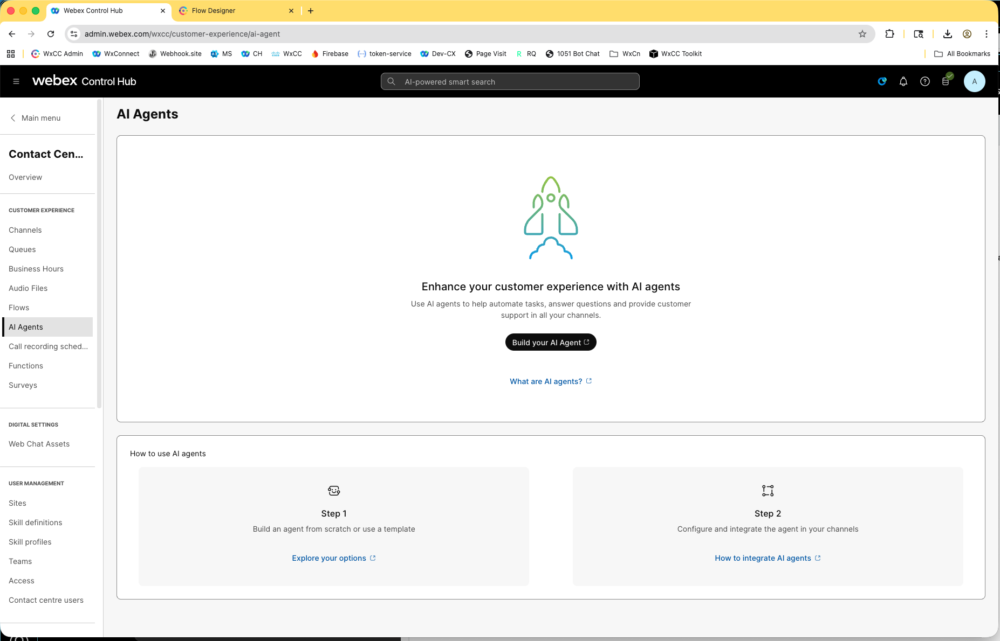
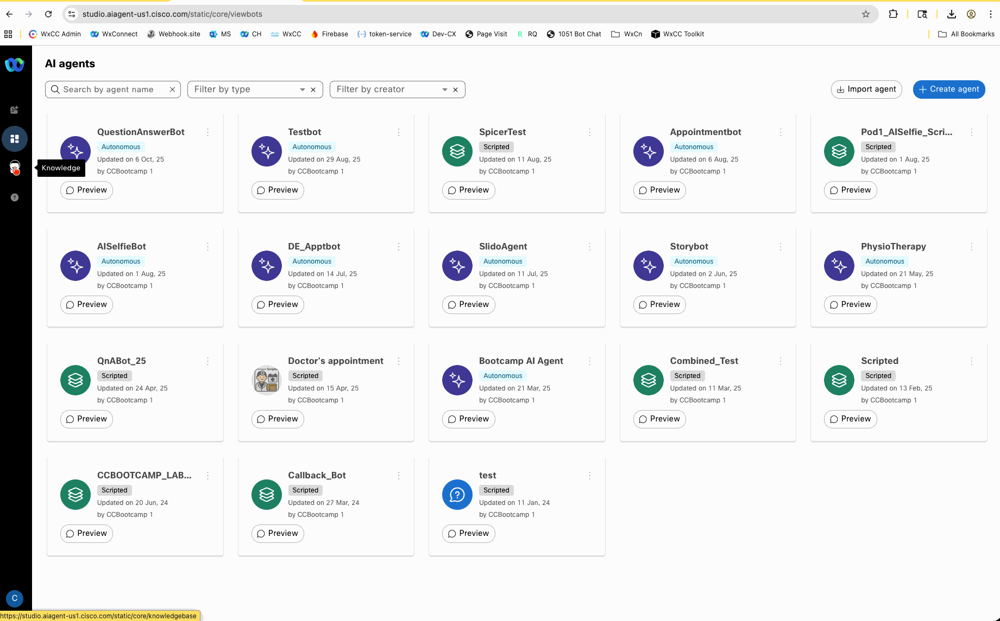
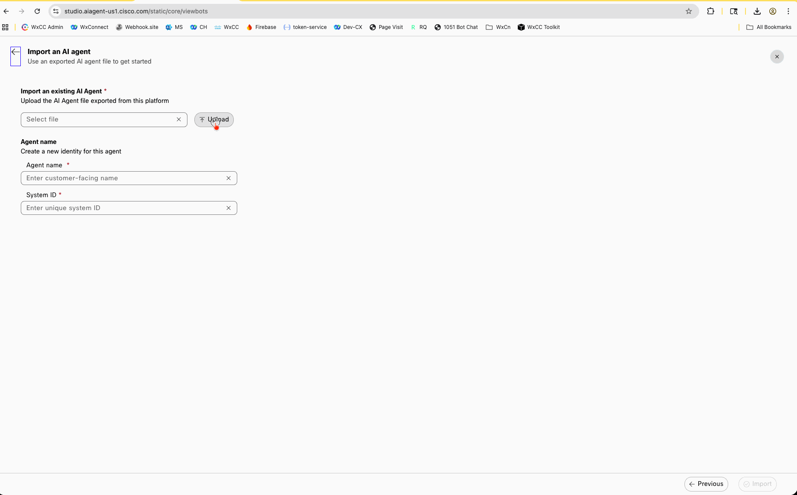
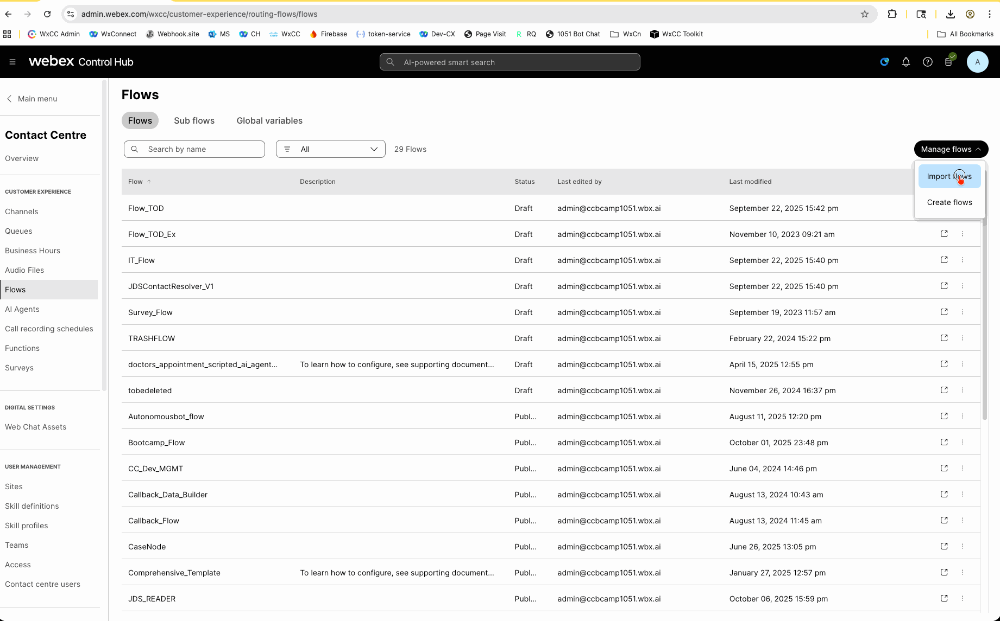
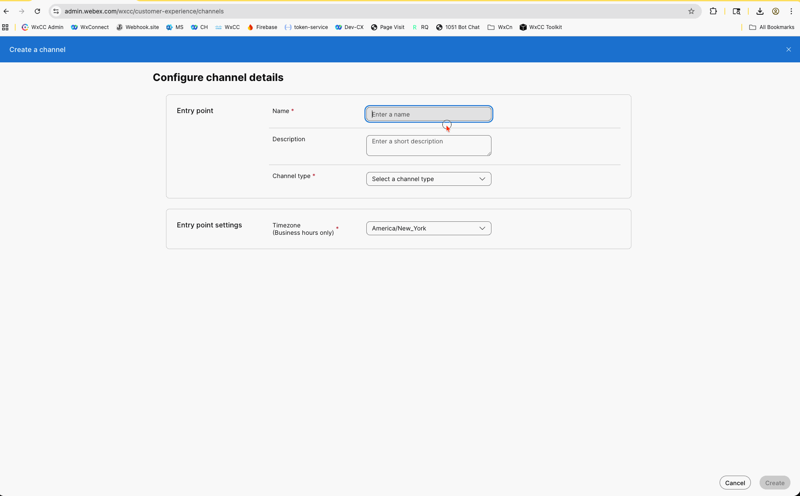

# Autonomous AI Agent Knowledge Base Bot

# License
All contents are licensed under the MIT license. Please see [license](LICENSE) for details.

# Disclaimer
Everything included is for demo and Proof of Concept purposes only. Use of the site is solely at your own risk. This site may contain links to third party content, which we do not warrant, endorse, or assume liability for. These demos are for Cisco Webex usecases, but are not Official Cisco Webex Branded demos.

# Questions
Please contact the CCEP team at [ccep@cisco.com](mailto:ccep@cisco.com?subject=payment-collections-demo) for questions.

### Solution Goals
This is a small collection of knowledge base articles for an autonomous AI Agent.  They are split into different verticals, and there are also sample flows included to get you up and running using voice as a channel to interact with the agents.  We assume PSTN has already been catered for using Cisco PSTN or a local gateway.

# Change Log

|Change Title|Date|Details|
|:---|:---:|:---|
|Update Instructions|10/08/25|Updated usage instructions, included sample flows|
|Add Healthcare|10/08/25|**Added Healthcare knowledge base, with details on how to:** How to claim insurance Types of insurance accepted How to book appointments Understanding coverage levels Range of treatment types offered Typical appointment and claim turnaround times Patient financial responsibilities Privacy and patient rights |General Update|10/06/25|Added sample voice flow, wrote readme file and adjusted autonomous agent instructions to point out this is for demo purposes and holds no real data.
|Add Retail|09/22/25|**Retail vertical added, with details on how to:** Key shipping documents (commercial invoice, packing slip, etc.) How and when to download shipping documents Shipping to home addresses and related restrictions Requesting changes or reporting issues with shipping documents Handling short, over, or damaged shipments Contacting customer service for shipping queries
|Add Finance|09/22/25|**Finance vertical added, with details on how to:**  Request withdrawals and add funds Typical processing times for transactions Linking or updating bank details Types of stock and share orders Transferring shares to another broker Associated fees for transactions Security measures for fund transfers How to contact customer support
|Repo Creation|09/22/25|Repo freshly created|

# Installation Instructions

<ol><li>Ensure you have a Webex Contact Center instance with AI Agent enabled and a PSTN connection enabled and working.  You should see the following menu in control hub; If you do not, contact your Cisco account representative and ask them to enable AI Agent.  Click the link to "Build your AI Agent"

</li>
<li>
Download your desired vertical KB file from this repo, create a new knowledge base in AI Agent studio and upload the file to process.

</li>
<li>
[Download the AI Agent](./CCEP_QuestionAnswerBot.json) itself.  From the black bar on the left of the AI Agent studio, select the dashboard. Import the downloaded agent into your AI Agent studio.  Select the knowledge base you just created, save and publish the agent.  Feel free to use the preview button in the top corner to test it out!

</li>

<li>
[Download the sample voice flow](./CCEP_Autonomous_template_flow.json), and import it into control hub from Contact Center -> Flows.  Open the flow in the flow designer, place it into Edit Mode and ensure that you open the virtual agent node.  Select the agent that you just imported.  Validate, and publish the flow.

</li>
<li>
Create a new inbound telephony channel in control hub, associate it with the flow you just created and populate the other required details. Assign a telelphone number to it, and save.

</li>

<li>
Dial into your newly created number and test the autonomous agent!
</li>